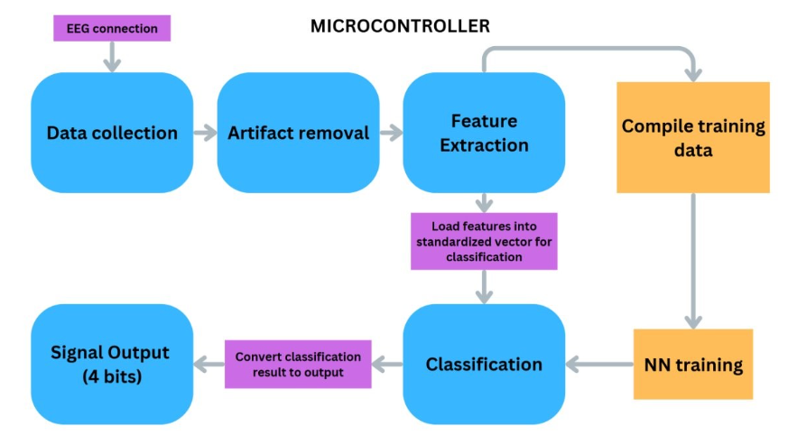
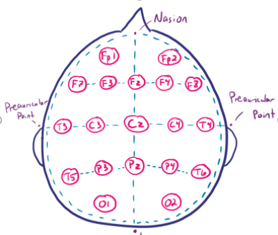
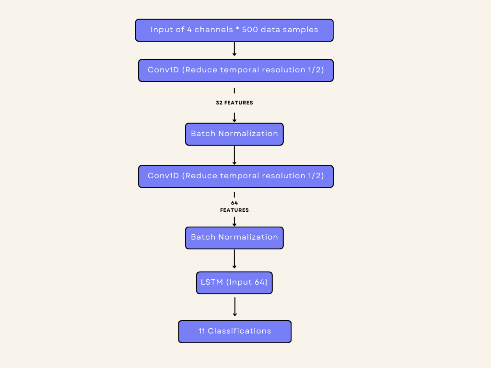

# A BCI Glove

By Shawn Xie, Nicholas Hung, Timothy Cheung, Gabriel Mansal, Daniel Kim, and Jim Pimentel

## Overview

Many people suffer from some form of mobile disability whether it bein the arms, hands or legs. This project aims at adressing the population who suffer from a form of hand paralysis. Some existing solutions include motor assisted grippers actuated via muscle stimulation (EMG) or preassure sensors if a subject can create minimal movements. However, these solutions fails at providing aid to those who can't create any form of stimulation in their hands or arms. By using EEG acquisition, we can use motor imagery as our primary control source for those who have no motor control in their arm to hand region.

## Introduction

The intention of the BCI Glove is to allow a user to actuate a glove via neural signals. At a high-level, the EEG signals will be passed into a classifier model which will produce 1 classification out of a total of 11. Each classification maps to a particular hand movement. The output of the model will then be sent to a microcontroller that actuates the motor. This repo will put more emphasis on the software design with some of the codebase relating to embedded system integration between the EEG acquisition and wireless communication devices.

Some key requirements we meet include

- Produces an accuracy of at least 50%
- Model must be deployable on microcontroller with inference time sub 50 ms

## Data Collection

### EEG Acquisition

For classication we leverage both spatial and temporal patterns in the EEG signals. The success of identifying spatial patterns heavily depends on the placement of the electrodes. We selected the region of the brain most responsible for controlling the hands which will be located around the motor cortex. Since our current application is targeted on the right hand, we will be biasing our placements to the left hemisphere of the brain. The specific placements is: C3, Cz, P3 and Pz.

These 4 electrodes will be sampled at 250 Hz with an initial band pass filter at 2.5 - 45 Hz and a notch filter at 58 - 62 Hz. The initial filtering will reduce any low frequency base-line drifts and any 60 Hz powerline noise. The EEG acquisition device we will be using the gTech Nautilus.

### Data Labeling

Inorder to streamline the data labelling process we used a [hand gesture recongnition algorithm](https://github.com/kinivi/hand-gesture-recognition-mediapipe). We custom trained the hand gesture model to recongnize specific had movements such as index open/close, middle finger open/close, etc. With this algorithm running in parallel with with the EEG acquisition, we can automate the data labeling process in real time.

## Classification

To implement real-time classification, we will use the rolling window method with a length of 2 seconds. So at 250 Hz sampling rate and 4 channels, the input vector will have a size of 2500. The model will first extract spatial features through 2 1D CNN layers which will be passed into LSTM cells that will extract temporal features.

